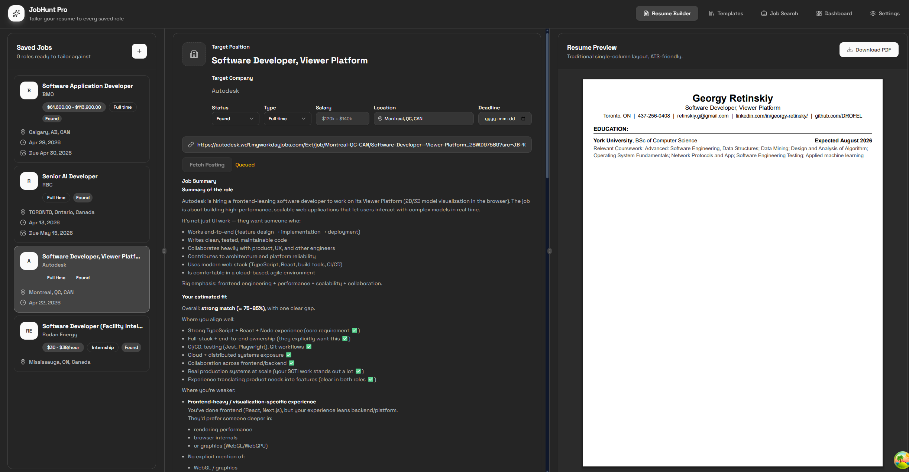
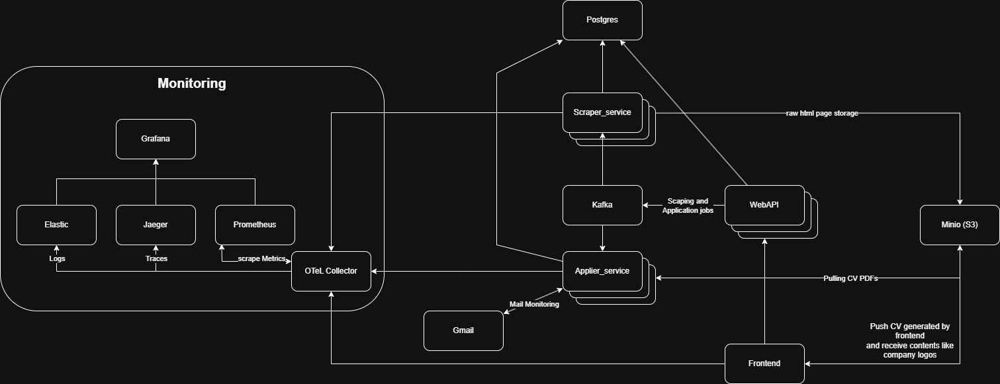

# JobHunter (WIP)

A personal job search automation platform. Scrape job postings, tailor your resume with AI, track applications, and (soon) auto-apply — all from one place.

---

## Screenshots

| Resume Workbench | Profile Settings |
|---|---|
|  |  |

---

## What It Does

### Resume Workbench
A three-panel editor: job selector sidebar, structured form, and live PDF preview. Maintain multiple resume versions, switch templates, and export to PDF. Covers contact info, summary, work experience, projects, skills, and languages.

### Job Scraping
Paste a job posting URL and the scraper extracts structured job data automatically — title, company, requirements, and description — and saves it to your job list. Runs as a background worker so scraping doesn't block the UI. Job board scraping comeing soon...

### AI Resume Tailoring (in progress)
Generate tailored resume content — summaries, work experience bullets, and job post summaries — using AI. The AI is context-aware: it pulls from your saved profile and the selected job posting to produce relevant output.

### Job Application Automation (DBT)
A companion worker that will auto-fill and submit job applications using browser automation. Currently scaffolded; the automation logic is in active development.

### Job Tracking
Save jobs, track their scrape status, and associate a tailored resume with each one. Full create/edit/delete support.

### Profile Settings
Store your skills, languages, education, and work history once. This data is used as context for AI generation and pre-populates new resumes.

## Roadmap

- [x] Resume workbench — build a tailored resume from profile + position data, export as PDF
- [x] Single-page job scraping — crawl a posting URL, extract structured data, generate a summary with LLM
- [ ] AI assistant in the resume workbench — inline suggestions for summary and experience bullets, skills
- [ ] Bulk job board scraping — auto-discover and import new postings on a schedule, with a UI for configuring scrape targets and settings
- [ ] Auto-apply — fill and submit applications automatically using browser automation + LLM
- [ ] Gmail monitoring — track application progress by reading incoming OTP codes and status update emails

---

## Running Locally

**Prerequisites:** Docker Compose, Python 3.12, Deno, `uv`
Project uses mise to manage this dependencies except for docker so you can run in root folder:
```
mise trust
mise install
```

**Environment setup (once per machine):**

The scraper requires an OpenRouter API key. Create `services/job_scraper/.env`:

```bash
echo "OPEN_ROUTER_SK=sk-or-v1-your-key" >> services/job_scraper/.env
```

```bash
# Setup: start infrastructure, install dependencies, apply configurations
# NEEDS TO BE RUN ONLY ONE PER ENVIRONMENT
make setup

# Start the API
make start

#Then go to http://localhost:5173

```

> To run the frontend with mocked API responses (no backend required):
> ```bash
> cd frontend && deno task mock
> ```


---

## High Level Architecture



The system is split into three backend services that communicate through a central message queue:

- **Frontend** — React app. Users build resumes, manage jobs, and trigger scrapes. Pushes generated CV PDFs to object storage and pulls back assets like company logos.
- **WebAPI** — REST API. Handles all user-facing operations and publishes scraping/application jobs onto the Kafka queue.
- **Scraper service** — Kafka consumer. Picks up scrape jobs, crawls the target page with a headless browser, extracts structured data via LLM, and saves results to PostgreSQL. Raw HTML pages are archived in MinIO (S3-compatible storage).
- **Applier service** — Kafka consumer (different topic). Will pull the tailored CV PDF from MinIO and auto-fill job applications using browser automation. Currently in development.

### Why Kafka

This project is partly a learning exercise, designed as if it would run in production for many users. Scraping, LLM extraction, and auto-applying are slow, resource-heavy, and fully asynchronous — so they live in dedicated worker services rather than inside the API. The frontend submits a job and moves on; Kafka holds it in the queue until a worker picks it up. Consumer groups guarantee that only one worker instance processes each job, which means scaling is trivial: if a worker runs out of resources, spinning up a second instance immediately adds capacity with no code or config changes. Resource distribution stays practical and predictable.

All services emit telemetry to an **OTel Collector**, which fans it out to Jaeger (traces), Prometheus (metrics), and Elasticsearch (logs). Grafana sits on top as the unified dashboard. Gmail integration is planned for monitoring application email responses and otp codes and registration emails for auto-applier.

---