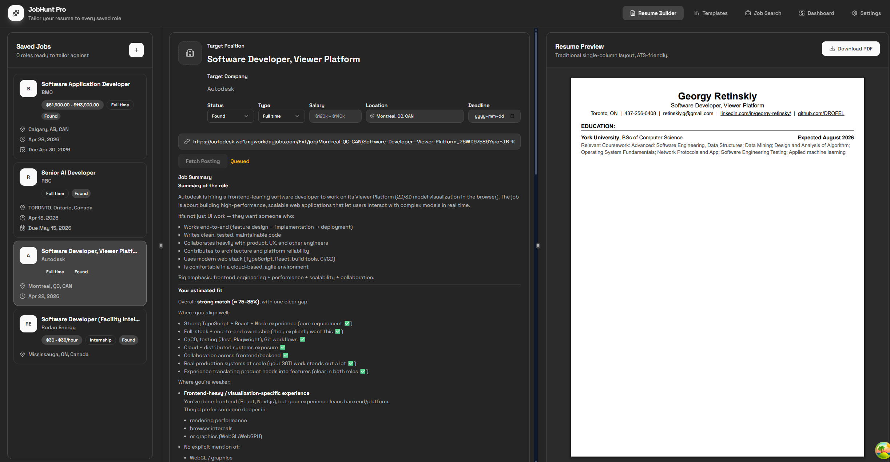
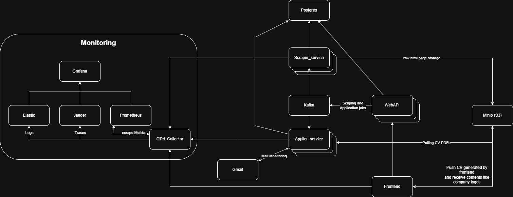
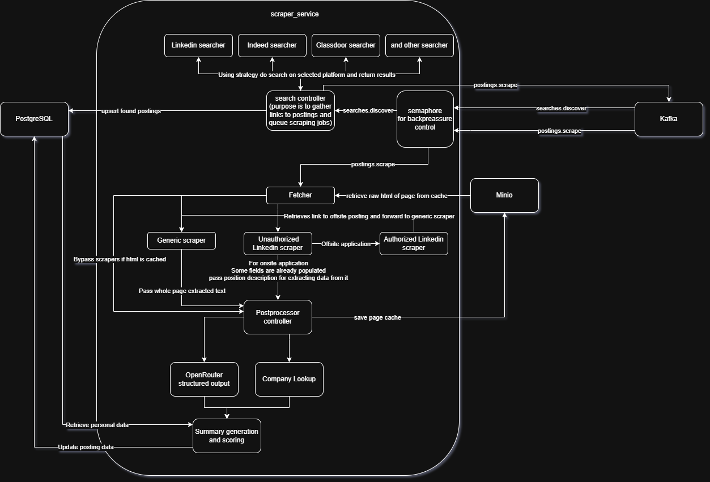

# JobHunter (WIP)

A personal job search automation platform. Scrape job postings, tailor your resume with AI, track applications, and (soon) auto-apply — all from one place.

---

## Screenshots

| Resume Workbench | Profile Settings |
|---|---|
|  |  |

---

## What It Does

### Resume Workbench
A three-panel editor: job selector sidebar, structured form, and live PDF preview. Maintain multiple resume versions, switch templates, and export to PDF. Covers contact info, summary, work experience, projects, skills, and languages.

### Job Scraping
Paste a job posting URL and the scraper extracts structured job data automatically — title, company, requirements, and description — and saves it to your job list. Runs as a background worker so scraping doesn't block the UI. Job board scraping comeing soon...

### AI Resume Tailoring (in progress)
Generate tailored resume content — summaries, work experience bullets, and job post summaries — using AI. The AI is context-aware: it pulls from your saved profile and the selected job posting to produce relevant output.

### Job Application Automation (DBT)
A companion worker that will auto-fill and submit job applications using browser automation. Currently scaffolded; the automation logic is in active development.

### Job Tracking
Save jobs, track their scrape status, and associate a tailored resume with each one. Full create/edit/delete support.

### Profile Settings
Store your skills, languages, education, and work history once. This data is used as context for AI generation and pre-populates new resumes.

## Roadmap

- [x] Resume workbench — build a tailored resume from profile + position data, export as PDF
- [x] Single-page job scraping — crawl a posting URL, extract structured data, generate a summary with LLM
- [ ] AI assistant in the resume workbench — inline suggestions for summary and experience bullets, skills
- [X] Bulk job board scraping — auto-discover and import new postings on a schedule, with a UI for configuring scrape targets and settings (Linkedin only at the moment)
- [ ] Auto-apply — fill and submit applications automatically using browser automation + LLM HITL
- [ ] Gmail monitoring — track application progress by reading incoming OTP codes and status update emails

---

## Running Locally (Tested only on Linux)

**Prerequisites:** Make, Docker Compose, Python 3.12, Deno, `uv`

Project uses mise to manage tool versions (except Docker and Make):
```bash
mise trust && mise install
```

**1. Configure environment**

`make setup` auto-creates `.env` from `.env.example` on first run. Open it and fill in your secrets:

| Variable | Required | Description |
|---|---|---|
| `OPEN_ROUTER_SK` | Yes | [OpenRouter](https://openrouter.ai) API key — used for LLM extraction |
| `LINKEDIN_ACCOUNTS` | No | JSON array of `{"email","password"}` objects for authenticated LinkedIn scraping |
| `PROXY` | No | HTTP proxy for outbound scraping requests |

All other values have working defaults for local development.

**2. Start everything**

```bash
# First time only: init .env, start infrastructure, install deps, fetch the camoufox browser (~150 MB), create Kafka topics + MinIO buckets
make setup

# Start all services (API, scraper, frontend)
make start
```

> The scraper uses [camoufox](https://github.com/daijro/camoufox) (anti-detect Firefox build) for browser automation. `make setup` runs `make setup-scraper` for you, which downloads the Camoufox Firefox binary into the venv. You can re-run `make setup-scraper` on its own if you ever wipe the cache.

Then open [http://localhost:5173](http://localhost:5173).

> To run the frontend with mocked API responses (no backend required):
> ```bash
> cd frontend && deno task mock
> ```


---

## High Level Architecture



The system is split into three backend services that communicate through a central message queue:

- **Frontend** — React app. Users build resumes, manage jobs, and trigger scrapes. Pushes generated CV PDFs to object storage and pulls back assets like company logos.
- **WebAPI** — REST API. Handles all user-facing operations and publishes scraping/application jobs onto the Kafka queue.
- **Scraper service** — Kafka consumer. Picks up scrape jobs, crawls the target page with a headless browser, extracts structured data via LLM, and saves results to PostgreSQL. Raw HTML pages are archived in MinIO (S3-compatible storage).
- **Applier service** — Kafka consumer (different topic). Will pull the tailored CV PDF from MinIO and auto-fill job applications using browser automation. Currently in development.

### Why Kafka

This project is partly a learning exercise, designed as if it would run in production for many users. Scraping, LLM extraction, and auto-applying are slow, resource-heavy, and fully asynchronous — so they live in dedicated worker services rather than inside the API. The frontend submits a job and moves on; Kafka holds it in the queue until a worker picks it up. Consumer groups guarantee that only one worker instance processes each job, which means scaling is trivial: if a worker runs out of resources, spinning up a second instance immediately adds capacity with no code or config changes. Resource distribution stays practical and predictable.

### Monitoring

All services emit telemetry to an **OTel Collector**, which fans it out to three backends:

- **Jaeger** — distributed traces (`:16686`)
- **Prometheus** — metrics (`:9090`)
- **Elasticsearch + Grafana** — structured logs and unified dashboards (`:3000`)

**Trace propagation across Kafka**

Trace context is injected into Kafka message headers on produce (`propagate.inject`) and extracted on consume (`propagate.extract`). This links the WebAPI span that triggered a scrape to the scraper span that processed it — a single trace ID covers the full journey from HTTP request through the queue to the worker, even across process and service boundaries. In Jaeger, this shows up as a connected trace with a link between the producer and consumer spans rather than a gap.

**Log–trace correlation**

Every log line emitted while a span is active is enriched with the current `trace_id`. The console formatter prints a short 8-character prefix (`[a3f2c1b0]`) for quick visual scanning. The OTel log exporter ships the full `trace_id` as a structured field to Elasticsearch, so you can paste a trace ID from Jaeger directly into a Grafana log query and see every log line from that exact request — across all services — in one view.

---

## Scraper Service Architecture



Both Kafka topics pass through a shared asyncio semaphore before work is dispatched. The semaphore provides backpressure: each consumer blocks on `await sem.acquire()` before spawning a task, so when `SCRAPER_CONCURRENCY` tasks are already running both consumers stop polling Kafka entirely until a slot opens. Every task releases the semaphore in `finally`, guaranteeing the slot is always returned. Set `SCRAPER_CONCURRENCY` in `.env` to tune throughput vs. resource usage.

**Discovery flow (`searches.discover`)** — The search controller uses a strategy pattern to delegate to a platform-specific searcher (LinkedIn today; Indeed, Glassdoor, and others planned). Each searcher fetches a page of job cards from its board's API and returns a list of posting URLs. The controller upserts the discovered postings into PostgreSQL, then publishes each new posting as an individual message to `postings.scrape` — decoupling discovery from scraping so each concern scales and retries independently.

**Scrape flow (`postings.scrape`)** — The scrape controller first checks the MinIO HTML cache; if the page was fetched before (e.g. on a previous attempt) the cached HTML is reused, skipping the browser entirely. On a cache miss, fetching branches by URL:

- **LinkedIn URLs** — the unauthorized LinkedIn scraper runs first. For onsite applications, the page already contains the job description and some structured fields, so these are passed directly to the postprocessor with partial data pre-populated. For offsite applications, the authorized LinkedIn scraper (using stored session cookies from MinIO) retrieves the external apply URL, which is then handed off to the generic scraper.
- **All other URLs** — the generic camoufox scraper fetches the page in a headed Firefox context, then converts the HTML to markdown via Crawl4AI's pruning markdown generator before handing the text to the postprocessor.

Once the raw page text is obtained, the **postprocessor controller** saves the HTML to the MinIO cache and runs three sequential steps: structured field extraction via OpenRouter LLM (title, company, salary, skills, dates), a company lookup to fetch or create a company profile, and finally summary generation — which pulls the user's personal profile context from PostgreSQL to produce a tailored job summary. The completed posting data is then written back to PostgreSQL.

---
